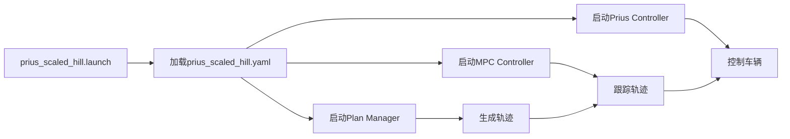

# Prius集成文件索引

## 📁 文件结构总览

```
src/uneven_planner/prius_integration/
├── 📋 文档文件
│   ├── Prius_Integration_Summary.md      # 完整技术方案文档
│   ├── Integration_Quick_Start.md        # 快速启动指南
│   └── File_Index.md                     # 本文件索引
│
├── ⚙️ 控制器包 (prius_scaled_controller/)
│   ├── config/
│   │   └── prius_scaled_hill.yaml        # 保守参数配置
│   ├── launch/
│   │   └── prius_scaled_hill.launch      # 集成启动文件
│   ├── src/
│   │   ├── prius_trajectory_controller.h     # 控制器头文件
│   │   ├── prius_trajectory_controller.cpp   # 控制器实现
│   │   └── model_tf_publisher.py             # TF发布脚本
│   ├── scripts/
│   │   └── model_tf_publisher.py         # TF发布脚本
│   └── README.md                         # 控制器说明
│
└── 🚗 车辆模型包 (prius_scaled_description/)
    ├── urdf/
    │   └── prius_scaled.urdf             # 缩放车辆模型
    ├── meshes/                           # 网格文件
    └── README.md                         # 模型说明
```

## 📋 核心文件说明

### 1. 主要文档

| 文件 | 用途 | 重要性 |
|------|------|--------|
| `Prius_Integration_Summary.md` | 完整技术方案、物理分析、配置说明 | ⭐⭐⭐⭐⭐ |
| `Integration_Quick_Start.md` | 快速部署和使用指南 | ⭐⭐⭐⭐ |
| `File_Index.md` | 文件结构说明（本文件） | ⭐⭐⭐ |

### 2. 配置文件

| 文件 | 用途 | 关键参数 |
|------|------|----------|
| `prius_scaled_hill.yaml` | 保守参数配置 | `max_acc_lon: 0.25`, `max_acc_lat: 0.33` |

### 3. 启动文件

| 文件 | 用途 | 启动命令 |
|------|------|----------|
| `prius_scaled_hill.launch` | 完整系统启动 | `roslaunch prius_scaled_controller prius_scaled_hill.launch` |

### 4. 源代码

| 文件 | 用途 | 编程语言 |
|------|------|----------|
| `prius_trajectory_controller.h/cpp` | Twist到Prius控制转换 | C++ |
| `model_tf_publisher.py` | TF链维护 | Python |

## 🔄 系统工作流程



## 🎯 使用优先级

### 新用户（首次使用）
1. 📖 阅读 `Integration_Quick_Start.md`
2. 🚀 运行快速启动命令
3. 🔧 根据需要调整参数

### 开发者（深度定制）
1. 📋 详读 `Prius_Integration_Summary.md`
2. ⚙️ 修改 `prius_scaled_hill.yaml`
3. 🔄 调试和优化

### 维护者（系统管理）
1. 📁 了解完整文件结构
2. 🔍 监控系统性能
3. 📝 更新文档

## 🛠️ 修改指南

### 参数调优
**文件**: `prius_scaled_controller/config/prius_scaled_hill.yaml`
- 性能不足 → 提高 `max_vel`, `max_acc_*`
- 不稳定 → 降低 `max_acc_*`, 增加 `matrix_q`

### 添加新地图
**文件**: `prius_scaled_hill.launch`
- 复制为新名称: `prius_scaled_[new_map].launch`
- 修改 `map_name` 默认值

### 调试模式
**启动参数**:
```bash
# 仅仿真
roslaunch prius_scaled_controller prius_scaled_hill.launch enable_planning:=false

# 不启动RViz
roslaunch prius_scaled_controller prius_scaled_hill.launch rviz:=false
```

## 📊 文件大小和复杂度

| 文件类型 | 数量 | 总大小 | 维护难度 |
|----------|------|--------|----------|
| 文档文件 | 3 | ~18KB | 低 |
| 配置文件 | 1 | ~3KB | 中 |
| 启动文件 | 1 | ~3KB | 中 |
| 源代码 | 3 | ~15KB | 高 |

## 🔗 依赖关系

```
prius_scaled_hill.launch
├── 依赖: prius_scaled_hill.yaml
├── 依赖: prius_scaled.urdf  
├── 依赖: plan_manager (uneven_planner)
├── 依赖: mpc_controller (uneven_planner)
└── 依赖: prius_trajectory_controller (自实现)
```

## 📈 版本历史

| 版本 | 日期 | 修改内容 |
|------|------|----------|
| v1.0 | 2024 | 初始集成版本，保守参数配置 |

---

**维护建议**: 定期检查参数配置的合理性，根据实际运行效果调整保守程度。 